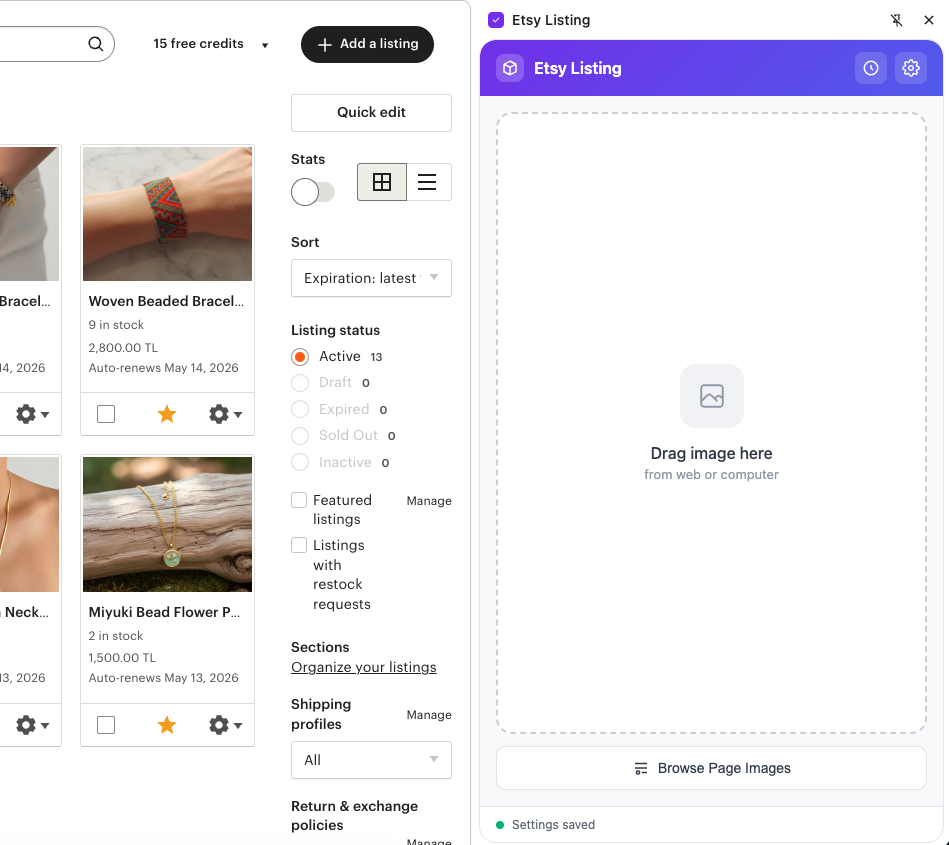
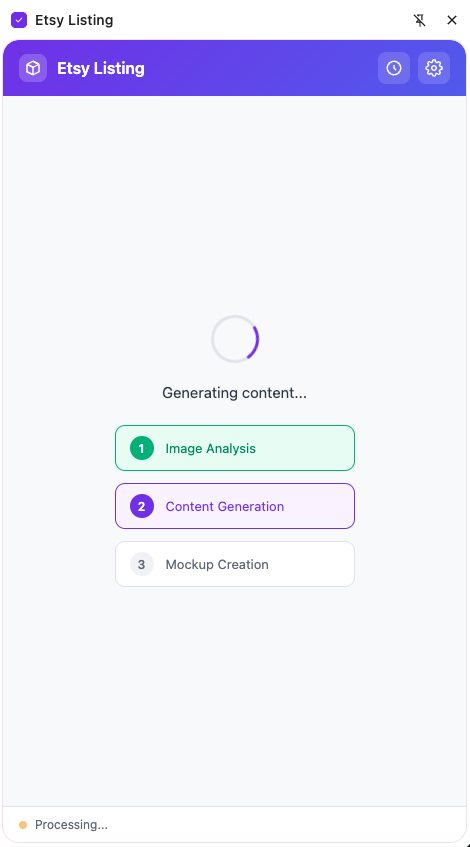
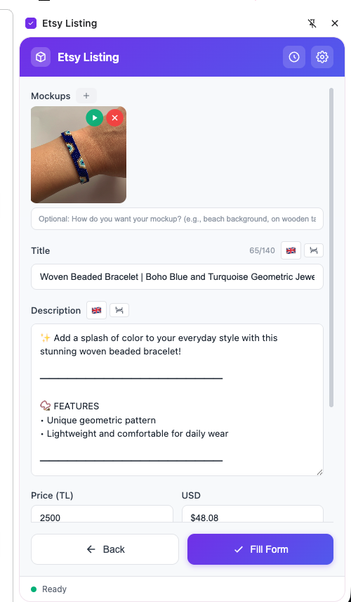
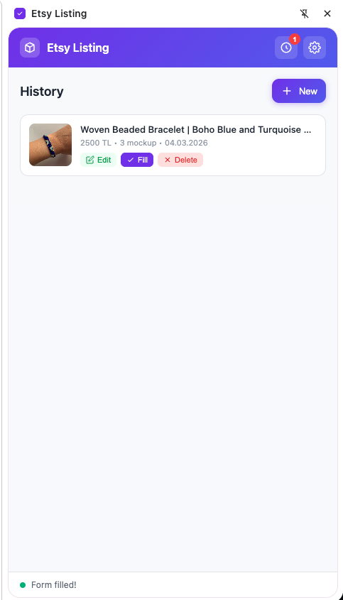

# Etsy Listing Creator

AI-powered Chrome extension for creating professional Etsy listings. Analyze images, generate optimized content, create mockups, and automatically fill listing forms.

## Screenshots

<p align="center">
  
  
</p>
<p align="center">
  
  
</p>

## Features

- 🖼️ **Image Analysis**: AI-powered product image analysis
- ✍️ **Content Generation**: Automatic title, description, and tag generation
- 🎨 **Mockup Creator**: Built-in product mockup generator
- 📝 **Auto-fill Forms**: Automatically populate Etsy listing forms
- 💾 **History**: Save and reuse previous listings
- 🌐 **Multi-language**: Turkish interface

## Installation

1. Clone this repository
```bash
git clone https://github.com/umutcetinkaya/etsy-listing-creator.git
```

2. Open Chrome and navigate to `chrome://extensions/`

3. Enable "Developer mode" in the top right

4. Click "Load unpacked" and select the extension directory

## Usage

1. Click the extension icon to open the side panel
2. Upload a product image or drag & drop
3. Configure AI settings (OpenAI or Gemini API key required)
4. Generate listing content
5. Create mockups (optional)
6. Navigate to Etsy's create listing page
7. Auto-fill the form with generated content

## Configuration

### API Keys

The extension supports two AI providers:

- **OpenAI GPT-4**: Requires OpenAI API key
- **Google Gemini**: Requires Gemini API key

Configure your preferred provider in the settings panel.

## Permissions

- `activeTab`: Access current tab for auto-filling forms
- `storage`: Save settings and listing history
- `scripting`: Inject content scripts for form automation
- `sidePanel`: Display extension in side panel

## Development

### File Structure

```
├── manifest.json       # Extension configuration
├── popup.html         # Main UI
├── popup.js           # UI logic
├── popup.css          # Styling
├── content.js         # Content script for form automation
├── content.css        # Content script styles
├── background.js      # Background service worker
└── icons/            # Extension icons
```

### Technologies

- Vanilla JavaScript
- Chrome Extensions API (Manifest V3)
- OpenAI GPT-4 API
- Google Gemini API

## License

MIT License - see [LICENSE](LICENSE) file for details

## Contributing

Contributions are welcome! Please feel free to submit a Pull Request.

## Support

For issues and questions, please [open an issue](https://github.com/umutcetinkaya/etsy-listing-creator/issues) on GitHub.
